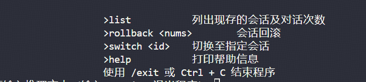
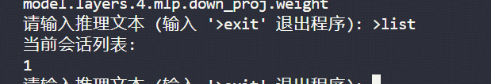
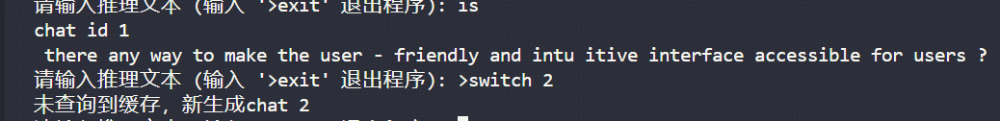
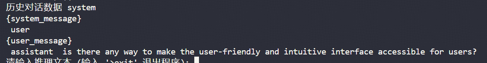
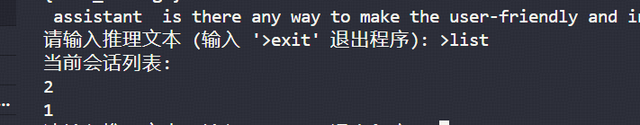
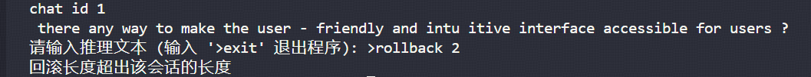
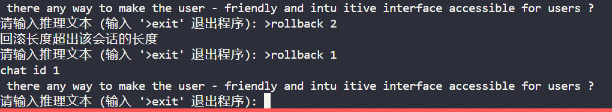
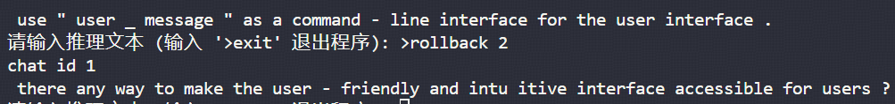
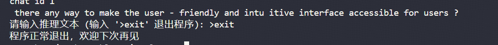

# 项目介绍
**项目地址**
https://github.com/onenewcode/learning-lm-rs

## f16 模型转换
该代码位于分支**f16**中，该分支的代码，将f32模型转换成f16模型，并实现了基本的推理功能。

### 技术介绍
- 模型转换方面，使用了transformers框架，把基本的f32模型转换成f16模型。转换代码在f16分支下面的model.ipynb文件中。
- f16方面，未使用第三方的half库，而是使用了一些非稳定特性，由于官方未实现部分迭代器的方法，需要自己手动实现

##

## 单机模型
### 功能介绍
- 会话切换
- 单机会话
- 会话回滚
- 支持异步输出
<!-- - 支持加载半精度模型(由于技术原因，存在部分硬编码，需要手动改) -->

### 技术介绍
**类型支持**
为了同时支持两种不同的类型，半精度方面采用了第三方库half，同时为了完成float的抽象，引入了第三方库num-traits，用来实现不同类型的抽象。
**异步输出**
同时为了支持异步输出，采用了tokio的异步编程，在推理的时候，会单独生成一个阻塞线程用于推理，用管道作为不同线程之间进行通信的方式，这样使程序可以异步的输出在控制台。
**缓存管理**
缓存管理使用为了初始化全局的变量，这里使用了非稳定的OnceLock结构，从而减少对外部的依赖。同时缓存是map结构，以用户的sessionid为key，value中存储了本次会话推理的长度，推理的历史数据用于实现会话回滚。

# 使用介绍
首先拉去代码，建议直使用chat_new分支下面的代码。如果使用的是vscode可以可以直接使用.vascode文件，经行debug运行。
当然也可以通过以下的命令行运行我们的单机对话 
>cargo run chat --model D:\project\rust\learning-lm-rs\models\chat

--model 后面是模型文件的路径，以上命令也是在也是在文件根目录下运行的

## 效果展示
**查看支持的命令**
我们可以通过 **>help** 查看我们当前单机推理模型支持的命令。

**对话界面**

我们可以在对话界面输入任意的对话内容，对话界面会首先输出我们当前对话的id，如图所框，接下来便会异步的输出我们的对话内容。

**对话切换**
对话切换的时候，通过 **>switch 1** 命令，切换到id为1的对话。默认我们的对话id为1。

如果我们在使用 **>switch** 命令，我们可以切换到任意一个对话。如果后面没有数字系统将会触发err，退出整个推理程序。

在切换到新的对话时，如果是输入的是新的id，则会新生成一个对话，如果输入的是已经存在的id，则会输出历史的对话。

新生成的对话

已经存在的对话

**显示会话列表**
我们可以通过 **>list** 命令，查看当前所有的对话id，可以用作 **>switch <id>**命令的切换。

**会话回滚**
我们可以通过 **>rollback <num>>** 命令，回滚1一次对话。我们的对话是通过把一次请求和响应作为一轮对话。如果回滚的长度大于当前的对话长度，则会发生错误提示。

超出长度的效果。

正常效果

**退出程序**
我们可以通过 **>exit** 命令，退出程序。

